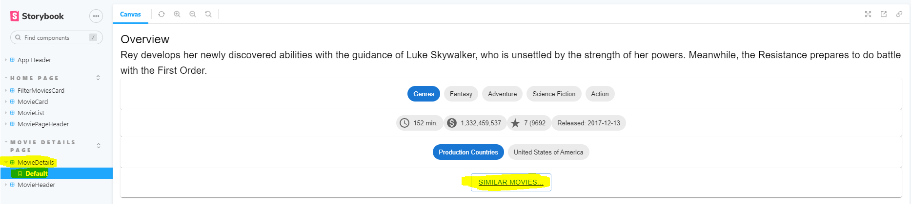

# Web App Dev 2 - Assignment 1 - ReactJS app.

Name: Ilija Gacov
## Overview.

### New Pages.

+ List of Popular Movies
+ (Modified) Movie Details page - added similar movies button
+ list of popular TV shows.

### New Features.

[ Provide a bullet-point list of the __new features__ you added to the Movies Fan app.] 
 
+ Tried to make an actors data model, but failed.
+ Tried to make a TV shows data model, it also didnt work.

## Setup requirements.

None that I know of.

## TMDB endpoints.

[ List the __additional__ TMDB endpoints used, giving the description and pathname for each one.] 

+ /movies/popular - list of popular movies.
+ /movie/{id}/similar - A list of similar movies. 
+ /person/popular - A list of popular actors.
+ person/${id} - actor id
+ person/${id}/images - images of an actor
+ discover/tv - list of tv shows
+ genre/tv/list - list of tv shows by genre
+ tv/{tv_id}/images - images from a specific tv show
+ tv/{tv_id}/reviews - reviews from a specific tv show
+ tv/popular - list of popular tv shows

## App Design.

### Component catalogue.

[ Insert a screenshot from the Storybook UI, and highlight the stories that relate to your __new/modified components__ - see the example screenshot below.] .......

e.g.

### UI Design.

[ Insert screenshots of the __new app pages__ you developed (including modified existing pages), Have an appropriate caption for each one (see example below).

>Shows popular movies.

>Shows the button on a movie details page that can be pressed to show similar movies.

>Shows the similar movies page.

>Shows the button on a movie details page that can be pressed to show similar movies.

>Shows the popular tv shows page, this is where my problems occur, when i look at the console, i find an error.

>Shows the error, it says that the resource requested can not be found, after altering the link, and trying to find a solution, the error still persisted.

### Routing.

[ List the __new routes__ supported by your app and state the associated page.]

e.g. 

+ /actors - displays a list of popular actors.
+ /actors/:id - shows details about a particular actor.
+ /movies/popular - shows popular movies
+ /movies/:id/similar - shows movies that are similar to a specific movie
+ /tv/:id - specific tv show
+ /tv - list of tv shows

## Independent learning (If relevant).

None